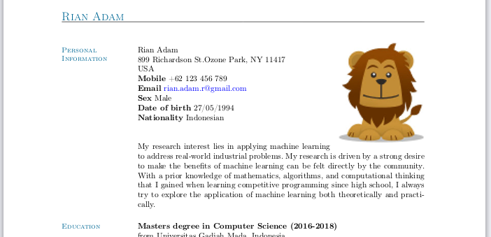

# Thomas Janssen's CV Template with Color

This is the modified version of the CV template by [Thomas Janssen](http://www.tjansson.dk/2009/03/writing-a-cv-in-latex/). In this template you can define the color of your CV. The color will be applied to the title and the side heading.



### Change The Color Theme

Change the color by changing the `themecolor` value in `resume.cls`:

```
...
\colorlet{themecolor}{_CHANGE_THE_COLOR_HERE_}
...
```

You can see the color list here [https://www.overleaf.com/learn/latex/Using_colours_in_LaTeX#Reference_guide](https://www.overleaf.com/learn/latex/Using_colours_in_LaTeX#Reference_guide)
